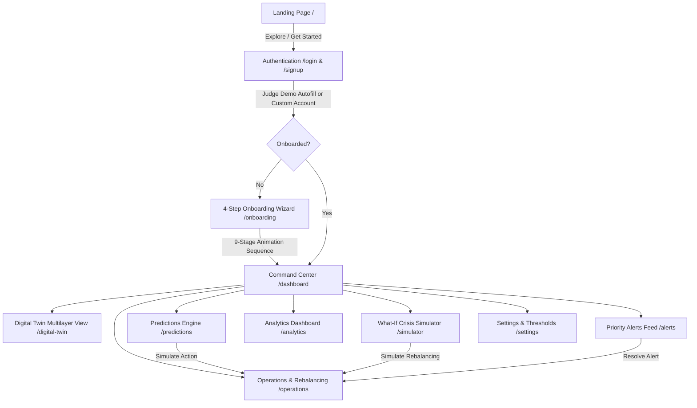

# 🛡️ EventTwin — HACKCELESTIAL 3.0
## Predict. Simulate. Optimize. | by Ghost Protocol
### AI-Powered Hospitality Digital Twin Platform for Mega-Events

[](https://react.dev/)
[](https://www.typescriptlang.org/)
[](https://tailwindcss.com/)
[](https://vitejs.dev/)
[](https://nodejs.org/)
[](https://maplibre.org/)
[](https://recharts.org/)

> **Core Value Proposition**: When 500,000+ visitors descend upon a metropolitan area for a mega-event, urban systems collapse due to isolated information silos. Hotels overbook check-in halls, transit platforms reach crush levels, venue turnstiles deadlock, and expressways gridlock—while peripheral zones sit half-empty with thousands of unused parking bays and vacant hotel inventory. 
> 
> **EventTwin** (developed by Team Ghost Protocol) solves this crisis by deploying a real-time **Geospatial Digital Twin** that unifies real infrastructure specifications with predictive simulation telemetry. It detects bottlenecks up to 45 minutes in advance and coordinates dynamic spatial rebalancing to relieve overloaded zones and stabilize city stress.

---

## 📑 Table of Contents

1. [Executive Overview & Problem Statement](#-executive-overview--problem-statement)
2. [End-to-End User Experience & Flow](#-end-to-end-user-experience--flow)
3. [Complete Feature Deep Dive](#-complete-feature-deep-dive)
4. [Real Mumbai Geographic Dataset & Digital Twin Model](#-real-mumbai-geographic-dataset--digital-twin-model)
5. [Mathematical Simulation Engine & Formulas](#-mathematical-simulation-engine--formulas)
6. [Phase 2 — Predictive Intelligence](#-phase-2--predictive-intelligence)
7. [System Architecture & Technology Stack](#-system-architecture--technology-stack)
8. [Complete REST API Specification](#-complete-rest-api-specification)
9. [Directory & File Organization](#-directory--file-organization)
10. [Installation & Quick Start Guide](#-installation--quick-start-guide)
11. [Demo Credentials & Evaluation Walkthrough](#-demo-credentials--evaluation-walkthrough)

---

## 🌍 Executive Overview & Problem Statement

Mega-events (global summits, conventions, concerts, and international sports tournaments) create extreme demand spikes that overwhelm municipal infrastructure:
- **Fragmented Silos**: Venue operators, hotel chains, public transit authorities, and municipal traffic police operate on disconnected communication channels.
- **Cascading Chokepoints**: A 15-minute gate delay at the convention center leads to turnstile bunching, which spills into parking ingress roads, blocking feeder bus lanes and stalling metro egress.
- **Unbalanced Demand**: In Mumbai's Bandra Kurla Complex (BKC), the core precinct (**Zone A**) faces 118%–125% overload, while the Kalina-Kurla corridor (**Zone C**) operates at 45% load with over **8,250 free parking spaces** and **280+ vacant hotel rooms**.

**EventTwin bridges this divide** through an interactive, multi-layered digital twin that continuously models city conditions, runs predictive what-if stress tests, and issues actionable operational intervention directives.

---

## 🧭 End-to-End User Experience & Flow

EventTwin features a seamless, role-protected operational journey:



---

## 🚀 Complete Feature Deep Dive

### 1. Futuristic Landing Page (`/`)
- **Visual Aesthetics**: Sleek dark-mode aesthetic (`#080d1a`) with ambient indigo and cyan radial glows, glassmorphism cards, and subtle micro-animations.
- **Value Proposition Hero**: *"Predict the city before the city gets overwhelmed."*
- **Urban Ecosystem Preview**: Interactive feature cards showcasing Venues, Hotels, Transit, and Parking integration.
- **Navigation Shortcuts**: Instant redirection to the Command Center if already authenticated, or direct entry into the Auth Portal.

### 2. Authentication & Role Clearance (`/login`, `/signup`)
- **Authentication Modes**: Email/Password authentication, quick registration, and protected JWT-like token handling (`gp_token_...`).
- **Judge Demo Auto-Fill**: One-click autofill for immediate evaluation (`alex@ghostprotocol.ai` / `password123`).
- **Role-Based Clearance**: Profiles for *City Operations*, *Event Organizer*, *Transport Authority*, and *Hospitality Lead*.
- **Route Guarding**: [`ProtectedRoute`](client/src/components/ProtectedRoute.tsx) shields all operational screens; unauthenticated requests redirect automatically to `/login`.

### 3. 4-Step Onboarding Wizard (`/onboarding`)
- **Step 1 — Event Classification**: Mega Event, Concert, Sports Tournament, Festival, Conference, or Custom.
- **Step 2 — Visitor Scale**: 500,000+ attendee scale preset with scalable capacity sliders.
- **Step 3 — Anchor Venue Selection**: Defaulted to Jio World Convention Centre (JWCC), Bandra Kurla Complex.
- **Step 4 — Infrastructure Ingestion Toggles**: Hotels, Transit Network, Parking Lots, Road Arteries, and Shuttle Corridors.
- **High-Tech 9-Stage Initialization Sequence**:
  1. `INITIALIZING DIGITAL TWIN`
  2. `LOADING REAL LOCATIONS`
  3. `MAPPING HOTELS`
  4. `MAPPING TRANSIT`
  5. `MAPPING VENUE`
  6. `BUILDING ROAD NETWORK`
  7. `LOADING SIMULATION ENGINE`
  8. `AI PREDICTION ENGINE READY`
  9. `DIGITAL TWIN ONLINE`

### 4. Main Command Center (`/dashboard`)
- **Telemetry Heartbeat**: Live simulation counter updating dynamically (*"🟢 SIMULATION RUNNING | Updated X seconds ago"*).
- **6 Core Operational KPI Cards**:
  | Metric | Value | Status | Details & Tooltip |
  | :--- | :--- | :--- | :--- |
  | **City Stress** | **82%** | 🔴 Critical | Tooltip: *"Prototype composite score calculated from simulated operational conditions across venues, transit, parking, and hotels."* |
  | **Visitors** | **500K+** | 🔵 Distributed | Distributed event scale across the broader Mumbai metropolitan area. |
  | **Critical Areas** | **3** | 🟡 Attention | Active chokepoints: JWCC Ingress, BKC Metro Line 3, Lot G. |
  | **Transit Load** | **91%** | 🔴 High Strain | BKC Metro Line 3 underground platform under severe strain. |
  | **Parking Load** | **78%** | 🟡 High | Aggregated capacity utilized across all core parking zones. |
  | **Hotel Occupancy** | **84%** | 🟣 Peak | Average occupancy across BKC and domestic airport transit corridors. |
- **Real Mumbai Map (MapLibre GL)**: Interactive vector map with color-coded pins, pulsing glow rings for critical assets, and connecting GeoJSON arterial lines.
- **Telemetry Drawer**: Click-to-inspect panel distinguishing verified real addresses/coordinates from simulated real-time operational streams, accompanied by an AI root-cause explanation box and direct navigation to predictive forecasts.

### 5. Multi-Layer Digital Twin (`/digital-twin`)
- **Geospatial View**: High-resolution MapLibre GL map centered on BKC (19.0638° N, 72.8682° E) using CartoDB dark raster basemaps.
- **Layer Toggle Controllers**:
  - 🏟️ **Venues (JWCC)**: Core convention halls and exhibition centers.
  - 🏨 **Real Hotels (6)**: Trident BKC, Sofitel, Grand Hyatt, Taj Santacruz, ITC Maratha, JW Marriott Sahar.
  - 🚇 **Transit Network (4)**: BKC Metro Line 3, Bandra Station, Kurla Station, CSMIA Airport.
  - 🅿️ **Parking Facilities (3)**: JWCC On-Premises, Kalina Spillover Lot, Bandra Reclamation Park & Ride.
  - 🚌 **Shuttle Corridors (1)**: Kalina-JWCC Dedicated Express Mobility Corridor.
- **Dedicated Sector Drilldown Tabs**:
  - `Ecosystem Real Map`: Full geospatial overview.
  - `JWCC Venue`: Focus on turnstile queues, hall capacity, and entrance gates.
  - `Real Hotels (6)`: Tabular and card view of room inventory, check-in pressures, and distance to JWCC.
  - `Transit Network`: Station flow metrics, platform loads, and feeder transfer points.
  - `Parking Facilities`: Total bay counts, occupancy ratios, and ingress choke telemetry.

### 6. Predictive Forecasting (`/predictions`)
- **What Will Happen Next?**: Forward-looking AI prediction engine forecasting bottlenecks before they trigger physical gridlock.
- **Problem Zone vs. Buffer Zone Comparison**:
  - **Zone A (Core Arena — JWCC Precinct)**: Current load **110%** $\rightarrow$ Predicted load **125%** in **42 minutes** (CRITICAL). Ingress turnstiles clocking 1,400 visitors/min.
  - **Zone C (Airport/Kalina Spillover Hub)**: Current load **52%** $\rightarrow$ Predicted load **45%** (AVAILABLE CAPACITY). Operating with **8,250 free parking bays** and **280+ vacant hotel rooms**.
- **Interactive Simulation**: `[ SIMULATE ACTION ]` button triggers celebration confetti and dynamically recalculates Zone A pressure from 125% down to **82%**.

### 7. What-If Crisis Simulator (`/simulator`)
- **Fine-Grained Scenario Sliders**:
  1. *Visitor Increase*: 0% to +100% (with quick presets for +10%, +20%, +30%, +50%).
  2. *Transit Capacity Shock*: 0% to 50% platform delay/reduction.
  3. *Parking Lot Closure*: 0% to 50% capacity reduction.
  4. *Rain / Monsoonal Weather Impact*: 0% to 50% mobility deceleration.
  5. *Venue Gate Delay*: 0 to 90 minutes check-in delay.
- **Dynamic Before vs. After Comparative Table**:
  - Clear **"SIMULATED RESULT"** indicator.
  - Real-time comparison across City Stress, Transit Load, Parking Load, Venue Load, Hotel Occupancy, and Critical Zones.
- **AI Recommendation Engine**:
  - *Action*: Diversion of incoming flow along the Kalina-Kurla bypass corridor.
  - *Why*: Relieves severe 125% JWCC turnstile congestion by leveraging Zone C's 45% load.
  - *Where*: Diverts Western Express Highway traffic toward Kalina overflow parking.
  - *Expected Effect*: Significantly relieves Zone A gate and transit bottlenecks and lowers overall city stress via spatial rebalancing.
- **Simulation Rebalancing**: Single-click `[ SIMULATE REBALANCING ]` action with confetti effects and instant state stabilization.

### 8. Operations & Dynamic Rebalancing (`/operations`)
- **Prescriptive Intervention Cards**:
  1. **REDIRECT VISITORS**: Diverts 18% of inbound visitors from Zone A to Zone C concourses, reducing gate crowd pressure by 24%.
  2. **REROUTE SHUTTLES**: Reroutes fleet from congested Western Express Highway onto the Kalina-Kurla bypass corridor, restoring transit load to 78% and eliminating 28-minute delays.
  3. **REDISTRIBUTE PARKING**: Diverts vehicle arrivals away from 92% full JWCC basements toward Kalina's 8,250 empty bays.
- **3-Stage Operational Lifecycle**:
  $$\text{SIMULATE ACTION} \xrightarrow{\text{Approve}} \text{ACTION APPROVED} \xrightarrow{\text{Dispatch}} \text{READY TO DISPATCH}$$
- Visual indicators update color-coded border states from neutral slate to indigo and glowing emerald.

### 9. Priority Alerts Feed (`/alerts`)
- **Structured Operational Triage**:
  - 🔴 **CRITICAL**: *JWCC area predicted to exceed simulated capacity pressure in 42 minutes.*
  - 🟡 **ATTENTION**: *Bandra Reclamation Park & Ride is 74% full and approaching threshold.*
  - 🔵 **AI INSIGHT**: *Zone C has available capacity (Kalina Hub at 45% load with 8,250 empty bays).*
- **Standardized Root-Cause Schema**:
  - **What happened**: Concrete sensor and telemetry trigger.
  - **Why it matters**: Cascading urban consequence if left unmitigated.
  - **What can be done**: Prescriptive dispatch intervention linking directly to Operations or Simulator.

### 10. Temporal Analytics (`/analytics`)
- **Timeframe Filters**: 2-Hour, 6-Hour, 12-Hour, and 24-Hour historical and forecasted views.
- **Recharts Data Visualizations**:
  - **City Hospitality Stress Curve**: Responsive `AreaChart` with gradient fill showcasing peak strain at 21:00 (82%).
  - **Visitor Flow Histogram**: Responsive `BarChart` illustrating hourly attendee distribution.
  - **Cross-Sector Comparison**: Multi-line `LineChart` tracking Venue, Transit, and Parking loads simultaneously.

### 11. Settings & Platform Clearance (`/settings`)
- Active event profile configuration (e.g., *"Mumbai Global Mega-Concert & Expo 2026"*).
- Stress alarm threshold slider (configurable from 70% to 95%).
- User clearance and active security role overview.

---

## 🗺️ Real Mumbai Geographic Dataset & Digital Twin Model

EventTwin enforces a strict boundary between **verified real-world infrastructure data** and **simulated operational telemetry**:

| Category | Name | Zone | Real Coordinates | Verified Published Spec | Simulated Baseline Load |
| :--- | :--- | :--- | :--- | :--- | :--- |
| **Venue** | **Jio World Convention Centre (JWCC)** | Zone A (Core) | 19.0638°N, 72.8682°E | On-premises parking for 5,000 cars, multi-hall complex | 84% Load (42,000 / 50,000) $\rightarrow$ Pred. 118% |
| **Hotel** | **Trident Bandra Kurla** | Zone A (Core) | 19.0671°N, 72.8699°E | 436 guest rooms & suites (approx. 0.44 km from JWCC) | 91% Occupancy (396 / 436) $\rightarrow$ Pred. 98% |
| **Hotel** | **Sofitel Mumbai BKC** | Zone A (Core) | 19.0655°N, 72.8660°E | 302 luxury rooms & suites (Accor directory) | 88% Occupancy (265 / 302) $\rightarrow$ Pred. 95% |
| **Hotel** | **Grand Hyatt Mumbai** | Zone B (Artery) | 19.0785°N, 72.8525°E | 547 rooms & 110 serviced apartments | 85% Occupancy (465 / 547) $\rightarrow$ Pred. 92% |
| **Hotel** | **Taj Santacruz** | Zone B (Artery) | 19.0910°N, 72.8540°E | 279 luxury rooms at Domestic Airport terminal | 82% Occupancy (228 / 279) $\rightarrow$ Pred. 88% |
| **Hotel** | **ITC Maratha** | Zone C (Spillover) | 19.1028°N, 72.8685°E | 380 rooms (Sahar Road) | 76% Occupancy (288 / 380) $\rightarrow$ Buffer available |
| **Hotel** | **JW Marriott Mumbai Sahar** | Zone C (Spillover) | 19.1015°N, 72.8752°E | 588 luxury rooms near International Terminal | **52% Occupancy (280+ free rooms)** |
| **Transit** | **BKC Metro Station (Aqua Line 3)** | Zone A (Core) | 19.0620°N, 72.8655°E | Underground high-capacity Colaba-Bandra-SEEPZ corridor | **91% Platform Load** $\rightarrow$ Pred. 108% (CRITICAL) |
| **Transit** | **Bandra Railway Station** | Zone B (Artery) | 19.0544°N, 72.8402°E | Western & Harbour Line suburban passenger junction | 83% Flow (49,800 / 60,000) |
| **Transit** | **Kurla Railway Station** | Zone C (Spillover) | 19.0657°N, 72.8793°E | Central & Harbour Line interchange junction | **48% Flow (52% Unused bandwidth)** |
| **Transit** | **CSMIA Airport (T1 & T2)** | Zone C (Spillover) | 19.0970°N, 72.8745°E | Mumbai International & Domestic Aviation Terminal Hub | 50% Ingress Load |
| **Parking** | **JWCC On-Premises Parking** | Zone A (Core) | 19.0635°N, 72.8675°E | Verified multi-level basement for 5,000 vehicles | **92% Full (4,600 / 5,000)** $\rightarrow$ Tailback Avenue 3 |
| **Parking** | **Kalina Overflow Staging Lot** | Zone C (Spillover) | 19.0750°N, 72.8690°E | Simulated temporary event staging facility | **45% Full (8,250 free bays)** |
| **Parking** | **Bandra Reclamation Park & Ride** | Zone B (Artery) | 19.0490°N, 72.8280°E | Simulated seaside Park & Ride grounds | 74% Full (8,880 / 12,000) |
| **Shuttle** | **Kalina-JWCC Express Corridor** | Zone C $\rightarrow$ A | 19.0700°N, 72.8710°E | 45 dedicated electric high-capacity shuttles | 44% Demand (Clear bypass artery) |

### GeoJSON Mobility Corridors
MapLibre GL dynamically renders vector arterial routes:
1. **Metro Line 3 Ingress Corridor**: BKC Station $\rightarrow$ JWCC Turnstiles (`#f43f5e`)
2. **Bandra-BKC Expressway Artery**: Bandra Station $\rightarrow$ Kalanagar $\rightarrow$ JWCC (`#f59e0b`)
3. **Kalina-Kurla Bypass Mobility Corridor**: Kalina Lot $\rightarrow$ CST Road $\rightarrow$ JWCC Gate 5 (`#10b981`)
4. **Western Express Highway Corridor**: CSMIA Airport $\rightarrow$ Santacruz $\rightarrow$ BKC (`#38bdf8`)

---

## 🧮 Mathematical Simulation Engine & Formulas

The core calculation logic in [`server/simulationEngine.js`](server/simulationEngine.js) models dynamic urban load, non-linear shock propagation, and spatial conservation across municipal networks:

### 1. Central EventTwin Stress Index
EventTwin computes one unified, explainable metric for system-wide pressure:

$$\text{Stress} = \text{Mobility} \times 0.30 + \text{Venue} \times 0.25 + \text{Parking} \times 0.20 + \text{Hotel} \times 0.15 + \text{DemandImbalance} \times 0.10$$

Each component is normalized to **[0, 100]**:
- **Mobility Stress (30%)**: Weighted composite of transit platform throughput ($80\%$) and express shuttle corridor pressure ($20\%$).
- **Venue Stress (25%)**: Venue ingress utilization and gate queue delay relative to effective turnstile capacity.
- **Parking Stress (20%)**: Aggregate utilization across on-premises, park-and-ride, and overflow parking hubs.
- **Hotel Stress (15%)**: Weighted hotel room occupancy across core and airport perimeter zones.
- **Demand Imbalance (10%)**: The disparity spread between the highest-loaded zone (e.g. Zone A at $125\%$) and the lowest-loaded zone (e.g. Zone C at $50\%$). Spatial rebalancing directly reduces this spread.

### 2. Separation of Load from Stress
Individual infrastructure loads are strictly calculated as:
$$\text{Load } \% = \frac{\text{Projected Demand}}{\text{Effective Capacity}} \times 100$$
A load above $100\%$ indicates that projected arrival demand exceeds physical design capacity (e.g., turnstile chokepoints or platform bottlenecks).

### 3. Spatial Conservation Laws
Interventions strictly obey physical conservation:
- **Visitor Conservation**: Diverting visitors from Zone A to Zone C preserves total event scale ($\sum \text{Visitors}_{\text{zone}} = \text{Total Visitors}$).
- **Vehicle Conservation**: Redirecting vehicles from JWCC basements to Kalina overflow lots strictly preserves total parked vehicles ($\sum \text{Vehicles}_{\text{facility}} = \text{Total Vehicles}$).

### 4. Dynamic Causal Ripple Effects
$$\text{Rain} \longrightarrow \text{Road capacity drops} \longrightarrow \text{Shuttle turnaround slows} \longrightarrow \text{Arrival bunching increases} \longrightarrow \text{Gate pressure surges} \longrightarrow \text{Parking dwell increases}$$
The simulation calculates each intermediate factor rather than modifying disconnected metrics. Outcomes are computed deterministically from input parameters and are never hardcoded.

---

## 🧠 Phase 2 — Predictive Intelligence

EventTwin Phase 2 introduces real-time multi-horizon predictive forecasting (15m, 30m, 45m) designed to detect infrastructure chokepoints before physical queues materialize.

### 1. Dual-Path Architecture (ML Seam + Deterministic Fallback)
EventTwin implements an enterprise-grade dual-path architecture in [`server/prediction/predictionService.js`](server/prediction/predictionService.js):
- **Path A: Machine Learning Model (`predictWithModel`)**:
  - Pluggable seam designed for Python ML models (e.g., Random Forest or Gradient Boosted Regressor via `child_process` or internal HTTP microservice).
  - Evaluates multi-horizon load vectors directly from high-dimensional scenario parameters.
- **Path B: Deterministic Fallback Extrapolation (`fallbackForecast.js`)**:
  - When the ML model is not available or throws during inference, the pipeline seamlessly falls back to physics-based extrapolation.
  - Leverages Phase 1's non-linear ripple-effect engine (turnstile gate congestion, transit platform delays, and parking dwell time accumulation) projected over 15, 30, and 45-minute horizons.
- **Transparent Attribution**:
  - The response payload explicitly sets `source: 'ml' | 'fallback-simulation'`.
  - Frontend components (`PredictionsPage`, `CommandCenterPage`, `AnalyticsPage`, `DigitalTwinPage`) strictly surface this attribution so operators know whether forecasts originate from an ML model or deterministic physics simulation.

### 2. Data Honesty Protocol
EventTwin adheres to strict data-honesty standards:
- **Never Claim Fallback is ML**: If the fallback simulation runs, it is explicitly labeled `"Forecast source: Simulation fallback"` or `"Deterministic Simulation"`. It is never falsely presented as AI/ML.
- **No Fake Metrics or Confidence Percentages**: In the absence of a trained model, the system displays `"Model metrics: pending training"` with documented insertion points for test-set evaluation metrics ($R^2$ score and MAE per horizon).

### 3. Risk Bands & Time-to-Threshold Interpolation
Operational risk is standardized into 4 distinct capacity bands via [`server/prediction/riskClassifier.js`](server/prediction/riskClassifier.js):
- `LOW`: $<70\%$ load (Normal operating capacity — Green)
- `MODERATE`: $70\% - 85\%$ load (Elevated attention required — Yellow)
- `HIGH`: $85\% - 100\%$ load (Severe strain approaching saturation — Orange)
- `CRITICAL`: $>100\%$ load (Overload / capacity breach — Red)

**Time-to-Threshold Linear Interpolation**:
The `timeToThreshold(currentLoad, futureLoadsByHorizon, horizonsMinutes, thresholdPercent = 100)` function calculates the exact minute an asset crosses capacity by linearly interpolating between the two closest temporal sample points:
$$t^* = t_1 + (t_2 - t_1) \cdot \frac{T - L_1}{L_2 - L_1}$$
Where:
- $T$ = Threshold load (default 100%)
- $t_1, t_2$ = Adjacent horizon minutes (e.g. 15m and 30m)
- $L_1, L_2$ = Projected loads at $t_1$ and $t_2$

Returns `0` if already above threshold, or `null` if the threshold is not crossed within the maximum horizon.

### 4. Causal Explanation Generator & TreeSHAP Insertion Point
The causal engine in [`server/prediction/explain.js`](server/prediction/explain.js) automatically constructs human-readable root-cause summaries by extracting and ranking the top 2–3 active scenario contributors:
- **Ranked Factors**: Visitor Inflow %, Monsoon Rain Impact %, Transit Disruption %, Gate Delay Throughput Drop %, Parking Reductions, and Arrival Waves.
- **Future ML Insertion Point**: Marked with an explicit `TODO` comment in `explain.js`. Once a model is trained, TreeSHAP / KernelSHAP feature attribution vectors can be directly injected into the explanation interface without breaking schema contracts.

### 5. Synthetic Training Data Generation
To prepare models for production training, [`server/prediction/dataGenerator.js`](server/prediction/dataGenerator.js) samples valid scenario spaces and drives the mathematical simulation engine to produce high-integrity training data:
```bash
# Generate 20,000 synthetic training rows
node server/prediction/dataGenerator.js --count 20000 --out server/prediction/data/training_data.csv
```
- **17 Feature Columns**: `visitor_count`, `zone_a_demand`, `zone_b_demand`, `zone_c_demand`, `venue_load`, `transit_load`, `parking_load`, `hotel_load`, `rain_factor`, `transit_disruption`, `parking_reduction`, `venue_delay`, `visitor_growth`, `future_zone_a_demand`, `future_zone_b_demand`, `future_zone_c_demand`, `future_venue_load`, `future_transit_load`, `future_parking_load`, `future_hotel_load`.
- **Validation**: Strict total visitor conservation ($\sum \text{Demand} = \text{Visitors}$) and non-negativity across all rows. Execution benchmark: 20,000 rows generated in $<1.0\text{s}$.

### 6. Cross-View Predictive Integration
Phase 2 intelligence is deeply woven into all core operational surfaces:
- **Command Center (`/dashboard`)**: "Next Critical Event" banner surfaces the earliest predicted saturation point with one-click mitigation navigation.
- **Alerts Feed (`/alerts`)**: Dedicated "🔴 PREDICTED CRITICAL RISK" category highlights assets approaching threshold with dynamic ETA badges.
- **Analytics (`/analytics`)**: Recharts `ComposedChart` displays forecasted stress curve alongside historical actuals with source badge.
- **Digital Twin (`/digital-twin`)**: "Current" vs "Predicted (+30m risk)" toggle dynamically recolors all 15 real Mumbai map pins by forecasted risk level.

---

## 🏛️ System Architecture & Technology Stack

```
                                  ┌──────────────────────────────────────────────┐
                                  │             BROWSER CLIENT                   │
                                  │   React 19 + TypeScript + Vite (:3000)       │
                                  └───────┬───────────────────────────────▲──────┘
                                          │                               │
                                   HTTP / REST API                 Vite Proxy
                                 Payload: JSON                  Target: :5000
                                          │                               │
                                  ┌───────▼───────────────────────────────┴──────┐
                                  │             BACKEND SERVER                   │
                                  │   Node.js + Express + CORS (:5000)           │
                                  └───────┬───────────────────────────────▲──────┘
                                          │                               │
                                          ▼                               ▼
                             ┌────────────────────────┐      ┌────────────────────────┐
                             │  Simulation Math Engine│      │  Real Mumbai Dataset   │
                             │  (calculateWhatIf)     │      │  (MUMBAI_LOCATIONS)    │
                             └────────────────────────┘      └────────────────────────┘
```

### Technology Breakdown

| Component | Library / Framework | Version | Purpose |
| :--- | :--- | :--- | :--- |
| **Frontend Framework** | **React** | `19.2.8` | Declarative UI component architecture |
| **Type System** | **TypeScript** | `~6.0.2` | Compile-time safety and interface contracts |
| **Build Tool** | **Vite** | `^8.3.0` | Sub-second HMR dev server & asset bundling |
| **Styling Engine** | **Tailwind CSS v4** | `^4.3.3` | Next-gen CSS design system via `@tailwindcss/vite` |
| **Vector Map Engine** | **MapLibre GL** | `^6.10.0` | Open-source GPU-accelerated WebGL vector mapping |
| **Chart Visualizations** | **Recharts** | `^3.10.1` | Responsive SVG area, bar, and line temporal charts |
| **Iconography** | **Lucide React** | `^1.46.0` | Clean, modern UI system icons |
| **Micro-Animations** | **Canvas Confetti** | `^1.9.4` | Particle celebration triggers on successful actions |
| **Backend Runtime** | **Node.js** | `>=18` | Asynchronous JavaScript runtime |
| **API Framework** | **Express.js** | `^4.21.2` | RESTful routing, payload validation, and server state |
| **Cross-Origin** | **CORS** | `^2.8.5` | Secure cross-origin resource sharing between 3000 & 5000 |

---

## 📡 Complete REST API Specification

The Express backend serves 12 production-ready REST endpoints:

### Authentication Endpoints
#### 1. `POST /api/auth/login`
- **Request Body**:
  ```json
  { "email": "alex@ghostprotocol.ai", "password": "password123" }
  ```
- **Response `200 OK`**:
  ```json
  {
    "success": true,
    "user": {
      "id": "user_1",
      "name": "Commander Alex",
      "email": "alex@ghostprotocol.ai",
      "role": "City Operations",
      "onboarded": true
    },
    "token": "gp_token_user_1"
  }
  ```

#### 2. `POST /api/auth/signup`
- **Request Body**:
  ```json
  {
    "fullName": "Sarah Chen",
    "email": "sarah@event.org",
    "password": "securepassword",
    "role": "Event Organizer"
  }
  ```
- **Response `201 Created`**: Returns newly created user profile and session token.

#### 3. `POST /api/auth/onboarding`
- **Request Body**: `{ "userId": "user_1" }`
- **Response `200 OK`**: `{ "success": true, "onboarded": true }`

#### 4. `GET /api/auth/me`
- **Response `200 OK`**: Returns current active session user.

---

### Digital Twin & Domain Endpoints

#### 5. `GET /api/events`
- Returns active mega-event baseline metadata, current visitor estimate (512,400), and operational status.

#### 6. `GET /api/digital-twin`
- Returns complete location list, summary statistics, verified counts, and primary anchor venue.

#### 7. `GET /api/venues`
- Filters locations by `category === 'Venue'`. Returns Jio World Convention Centre (JWCC).

#### 8. `GET /api/hotels`
- Filters locations by `category === 'Hotel'`. Returns 6 verified Mumbai hotels with live occupancy rates.

#### 9. `GET /api/parking`
- Filters locations by `category === 'Parking'`. Returns JWCC basement, Kalina spillover, and Bandra Reclamation lots.

#### 10. `GET /api/transit`
- Filters locations by `category === 'Transit'`. Returns BKC Metro Line 3, Bandra Station, Kurla Station, and CSMIA Airport.

#### 11. `GET /api/shuttles`
- Returns dedicated express shuttle corridors and fleet telemetry.

#### 12. `GET /api/predictions`
- Evaluates canonical state across 7 resources (Zones A/B/C, Venue, Transit, Parking, Hotel) across 15m, 30m, and 45m horizons.
- Surfaces current load, projected loads, risk labels (`LOW`, `MODERATE`, `HIGH`, `CRITICAL`), `nextCriticalEvent` (soonest critical threshold crossing with interpolated minutes), and truthful attribution (`source: "ml" | "fallback-simulation"`).

#### 13. `POST /api/predictions/scenario`
- **Request Body**: Accepts custom what-if scenario parameters (`visitorIncreasePct`, `rainImpactPct`, `transitReductionPct`, `parkingReductionPct`, `venueDelayMinutes`).
- **Response**: Computes updated state via `simulationEngine`, runs predictive pipeline, and generates causal contributors and human-readable explanation text via `explain.js`.

#### 14. `GET /api/alerts`
- Returns structured priority alert feed categorized by `CRITICAL`, `ATTENTION`, and `AI INSIGHT`.

#### 14. `POST /api/simulation`
- **Request Body**:
  ```json
  {
    "visitorIncreasePct": 30,
    "transitReductionPct": 0,
    "parkingReductionPct": 0,
    "rainImpactPct": 0,
    "venueDelayMinutes": 0,
    "isRebalanced": false
  }
  ```
- **Response `200 OK`**: Returns recalculations with `before`, `after`, and structured `aiRecommendation`.

#### 15. `POST /api/interventions/simulate`
- Simulates the execution of prescriptive dynamic rebalancing, calculating the new state based on spatial conservation laws and returning measured stress reductions.

#### 16. `POST /api/digital-twin/run`
- Heartbeat trigger updating `eventData.lastUpdated` timestamp.

---

## 📂 Directory & File Organization

```
hack-celestial/
├── README.md                      # Comprehensive project documentation (You are here)
├── run.bat                        # Single-click Windows launch script
├── server/                        # Express.js REST API & Simulation Engine
│   ├── index.js                   # REST endpoints, auth, and state persistence
│   ├── simulationEngine.js        # Core mathematical simulation, stress index, conservation
│   ├── prediction/                # Phase 2 Predictive Intelligence Engine
│   │   ├── dataGenerator.js       # Synthetic dataset generator driving simulateScenario
│   │   ├── explain.js             # Causal explanation & top contributor extractor
│   │   ├── fallbackForecast.js    # Multi-horizon physics-based deterministic extrapolation
│   │   ├── predictionRoutes.js    # REST router for /api/predictions & /scenario
│   │   ├── predictionService.js   # Dual-path prediction engine (ML seam + fallback)
│   │   ├── riskClassifier.js      # 4 risk bands & time-to-threshold interpolation
│   │   └── riskClassifier.test.js # Risk bands & interpolation unit tests
│   ├── data.js                    # Real Mumbai locations & baseline event state
│   ├── firebase.js                # Firebase Realtime Database connector & fallback
│   ├── test_simulation.js         # Phase 1 simulation test harness
│   └── package.json               # Server scripts & dependencies (express, cors)
└── client/                        # React 19 + TypeScript + Vite + Tailwind CSS v4
    ├── index.html                 # App HTML shell with Inter & Outfit fonts
    ├── vite.config.ts             # Tailwind v4 plugin & /api proxy to localhost:5000
    ├── tsconfig.json              # TypeScript root configuration
    ├── package.json               # Client dependencies (React 19, MapLibre, Recharts)
    └── src/
        ├── main.tsx               # Client entry point
        ├── App.tsx                # Client-side router & protected route hierarchy
        ├── index.css              # Global design tokens, custom glassmorphism styles
        ├── App.css                # Layout & utility definitions
        ├── context/
        │   └── AuthContext.tsx    # Auth state, login/signup handlers, token persistence
        ├── components/
        │   ├── ProtectedRoute.tsx # Route barrier redirecting unauthenticated users
        │   ├── DashboardLayout.tsx# Persistent sidebar layout with responsive container
        │   ├── Sidebar.tsx        # Navigation sidebar with route indicators & user tag
        │   └── RealMumbaiMap.tsx  # MapLibre GL map engine with GeoJSON corridors & pins
        ├── data/
        │   └── mumbaiLocations.ts # TypeScript interfaces & verified Mumbai dataset
        └── pages/
            ├── LandingPage.tsx    # Futuristic product landing hero & walkthrough
            ├── LoginPage.tsx      # Sign-in portal with 1-click Judge Demo autofill
            ├── SignupPage.tsx     # Role-based account registration
            ├── OnboardingPage.tsx # 4-step wizard with 9-stage initialization sequence
            ├── CommandCenterPage.tsx # Main dashboard with 6 KPI cards, map, & telemetry
            ├── DigitalTwinPage.tsx# Multilayer toggle view & category drilldown tabs
            ├── PredictionsPage.tsx# Bottleneck forecast & Zone A -> C rebalance trigger
            ├── SimulatorPage.tsx  # What-If simulator with 6 shock sliders & presets
            ├── OperationsPage.tsx # 3-stage dispatch action cards
            ├── AnalyticsPage.tsx  # Recharts temporal trends (2h, 6h, 12h, 24h)
            ├── AlertsPage.tsx     # Triage feed (What happened / Why it matters / Actions)
            └── SettingsPage.tsx   # Alarm thresholds, event title, & role clearance
```

---

## ⚡ Installation & Quick Start Guide

### Prerequisites
- [Node.js](https://nodejs.org/) (Version 18.0.0 or higher recommended)
- [npm](https://www.npmjs.com/) (bundled with Node.js)

### Option 1: Single-Click Launcher (Windows)
Double-click [`run.bat`](run.bat) in the project root. This automatically opens two terminal windows:
1. **EventTwin Server** on `http://localhost:5000`
2. **EventTwin Client** on `http://localhost:3000`

### Option 2: Manual Terminal Setup

#### Step 1: Start the Backend API
```powershell
cd server
npm install
npm start
```
*API Server running on: [http://localhost:5000](http://localhost:5000)*

#### Step 2: Start the Web Client
Open a second terminal window:
```powershell
cd client
npm install
npm run dev
```
*Web Application running on: [http://localhost:3000](http://localhost:3000)*

---

## 🔑 Demo Credentials & Evaluation Walkthrough

For hackathon judges and evaluators, use the instant demo credentials:

- **Email**: `alex@ghostprotocol.ai`
- **Password**: `password123`
- *(Or click the `Demo Fill: Commander Alex` button on the [Login Page](http://localhost:3000/login) for instant entry)*

### Recommended 5-Minute Judge Demo Script:
1. **Landing Page (`/`)**: Review the problem statement and press **ENTER COMMAND CENTER**.
2. **Login (`/login`)**: Click **Demo Fill** and hit **Sign In**.
3. **Onboarding (`/onboarding`)**: Watch the 9-stage digital twin compilation sequence link Mumbai's infrastructure.
4. **Command Center (`/dashboard`)**:
   - Inspect the **City Stress (82%)** KPI and hover over the ⓘ tooltip.
   - Click any pin on the **Real Mumbai Map** (e.g., *Jio World Convention Centre* or *Trident BKC*) to view the real address alongside simulated loads.
5. **Predictions (`/predictions`)**: Observe Zone A's forecasted 125% overload. Click **SIMULATE ACTION** to see instant mitigation.
6. **Crisis Simulator (`/simulator`)**:
   - Drag the *Visitor Increase* slider to `+50%` or click the `Heavy Rain + Transit Down` preset.
   - Note the unmitigated jump in city stress and critical areas.
   - Click **SIMULATE REBALANCING** to watch the mathematical engine calculate the mitigated state and measure the exact stress reduction.
7. **Operations (`/operations`)**:
   - Advance the 3 prescriptive action cards through `SIMULATE ACTION` $\rightarrow$ `ACTION APPROVED` $\rightarrow$ `READY TO DISPATCH`.
8. **Analytics (`/analytics`) & Alerts (`/alerts`)**: Inspect temporal strain curves and structured operational alert breakdowns.

---

<p align="center">
  <strong>Built with pride for HackCelestial 3.0</strong><br>
  <em>Empowering smart cities with predictive digital twin intelligence.</em>
</p>
